## Imports

Pandas and Numpy are used for data processing, mainpulation, and analysis. Matplotlib and Seaborn are used for explanatory data visualization


```python
import pandas as pd
import numpy as np
import matplotlib.pyplot as plt
import seaborn as sns
import warnings
warnings.filterwarnings("ignore")
```

# Data Processing

First the boring stuff, data processing and manipulation.


```python
df = pd.read_csv('EPLsalaries.csv', encoding='latin8')
df.head()
```


<div>
<style scoped>
    .dataframe tbody tr th:only-of-type {
        vertical-align: middle;
    }

    .dataframe tbody tr th {
        vertical-align: top;
    }

    .dataframe thead th {
        text-align: right;
    }
</style>
<table border="1" class="dataframe">
  <thead>
    <tr style="text-align: right;">
      <th></th>
      <th>Rank</th>
      <th>Player</th>
      <th>Weekly Salary</th>
      <th>Pos.</th>
      <th>Age</th>
      <th>Status</th>
      <th>Length (Yrs)</th>
      <th>2018-19 Salary</th>
      <th>2019-20 Salary</th>
      <th>2020-21 Salary</th>
      <th>2021-22 Salary</th>
      <th>2022-23 Salary</th>
      <th>2023-24 Salary</th>
      <th>2024-25 Salary</th>
      <th>Club</th>
    </tr>
  </thead>
  <tbody>
    <tr>
      <th>0</th>
      <td>1</td>
      <td>Alexis S‡nchez (http://www.capology.com/soccer...</td>
      <td>$461,765</td>
      <td>LW</td>
      <td>30</td>
      <td>Reserve</td>
      <td>4</td>
      <td>$24,011,806</td>
      <td>$24,011,806</td>
      <td>$24,011,806</td>
      <td>$24,011,806</td>
      <td>$0</td>
      <td>$0</td>
      <td>$0</td>
      <td>Manchester United</td>
    </tr>
    <tr>
      <th>1</th>
      <td>2</td>
      <td>Mesut …zil (http://www.capology.com/soccer/pla...</td>
      <td>$461,765</td>
      <td>AM</td>
      <td>30</td>
      <td>Starter</td>
      <td>3</td>
      <td>$24,011,806</td>
      <td>$24,011,806</td>
      <td>$24,011,806</td>
      <td>$0</td>
      <td>$0</td>
      <td>$0</td>
      <td>$0</td>
      <td>Arsenal</td>
    </tr>
    <tr>
      <th>2</th>
      <td>3</td>
      <td>Gonzalo Higua’n (http://www.capology.com/socce...</td>
      <td>$400,290</td>
      <td>CF</td>
      <td>31</td>
      <td>Reserve</td>
      <td>1</td>
      <td>$20,815,069</td>
      <td>$0</td>
      <td>$0</td>
      <td>$0</td>
      <td>$0</td>
      <td>$0</td>
      <td>$0</td>
      <td>Chelsea</td>
    </tr>
    <tr>
      <th>3</th>
      <td>4</td>
      <td>Paul Pogba (http://www.capology.com/soccer/pla...</td>
      <td>$382,606</td>
      <td>CM</td>
      <td>26</td>
      <td>Starter</td>
      <td>3</td>
      <td>$19,895,496</td>
      <td>$19,895,496</td>
      <td>$19,895,496</td>
      <td>$0</td>
      <td>$0</td>
      <td>$0</td>
      <td>$0</td>
      <td>Manchester United</td>
    </tr>
    <tr>
      <th>4</th>
      <td>5</td>
      <td>Kevin De Bruyne (http://www.capology.com/socce...</td>
      <td>$303,624</td>
      <td>AM</td>
      <td>27</td>
      <td>Starter</td>
      <td>5</td>
      <td>$15,788,422</td>
      <td>$15,788,422</td>
      <td>$15,788,422</td>
      <td>$15,788,422</td>
      <td>$15,788,422</td>
      <td>$0</td>
      <td>$0</td>
      <td>Manchester City</td>
    </tr>
  </tbody>
</table>
</div>


We won't need future Salary values for this analysis so let's drop those columns from our dataframe


```python
df = df.drop(labels=['2019-20 Salary', '2020-21 Salary', '2021-22 Salary', '2022-23 Salary', '2023-24 Salary', '2024-25 Salary'], axis=1)
```

Now let's edit the player names so that the website link is cut out


```python
#Regex for pandas for below lambda function
```


```python
df['Player'] = df['Player'].str.split("(")
for index, row in df.iterrows():
    df['Player'][index] = df['Player'][index][0]
    
df.tail()
```


<div>
<style scoped>
    .dataframe tbody tr th:only-of-type {
        vertical-align: middle;
    }

    .dataframe tbody tr th {
        vertical-align: top;
    }

    .dataframe thead th {
        text-align: right;
    }
</style>
<table border="1" class="dataframe">
  <thead>
    <tr style="text-align: right;">
      <th></th>
      <th>Rank</th>
      <th>Player</th>
      <th>Weekly Salary</th>
      <th>Pos.</th>
      <th>Age</th>
      <th>Status</th>
      <th>Length (Yrs)</th>
      <th>2018-19 Salary</th>
      <th>Club</th>
    </tr>
  </thead>
  <tbody>
    <tr>
      <th>492</th>
      <td>493</td>
      <td>Lucas Perri</td>
      <td>$1,725</td>
      <td>GK</td>
      <td>21</td>
      <td>Reserve</td>
      <td>1</td>
      <td>$89,714</td>
      <td>Crystal Palace</td>
    </tr>
    <tr>
      <th>493</th>
      <td>494</td>
      <td>Jack Rose</td>
      <td>$1,053</td>
      <td>GK</td>
      <td>24</td>
      <td>Reserve</td>
      <td>2</td>
      <td>$54,752</td>
      <td>Southampton</td>
    </tr>
    <tr>
      <th>494</th>
      <td>495</td>
      <td>Sean Longstaff</td>
      <td>$913</td>
      <td>CM</td>
      <td>21</td>
      <td>Reserve</td>
      <td>4</td>
      <td>$47,496</td>
      <td>Newcastle</td>
    </tr>
    <tr>
      <th>495</th>
      <td>496</td>
      <td>Michael Obafemi</td>
      <td>$787</td>
      <td>CF</td>
      <td>18</td>
      <td>Reserve</td>
      <td>4</td>
      <td>$40,899</td>
      <td>Southampton</td>
    </tr>
    <tr>
      <th>496</th>
      <td>497</td>
      <td>Dwight McNeil</td>
      <td>$660</td>
      <td>LW</td>
      <td>19</td>
      <td>Reserve</td>
      <td>5</td>
      <td>$34,303</td>
      <td>Burnley</td>
    </tr>
  </tbody>
</table>
</div>


Now lets check the data types for each column so that we can change them into workable formats for our coming data analysis. We want Weekly Salary, Age, Contract Length, and Annual Salary to be integers, while the rest are strings (objects).


```python
df.dtypes
```


    Rank               int64
    Player            object
    Weekly Salary     object
    Pos.              object
    Age                int64
    Status            object
    Length (Yrs)       int64
    2018-19 Salary    object
    Club              object
    dtype: object


```python
df['Weekly Salary'] = df['Weekly Salary'].str.strip('$')
df['2018-19 Salary'] = df['2018-19 Salary'].str.strip('$')

df['Weekly Salary'] = df['Weekly Salary'].str.replace(",", "")
df['2018-19 Salary'] = df['2018-19 Salary'].str.replace(",", "")

df['Weekly Salary'] = pd.to_numeric(df['Weekly Salary'])
df['2018-19 Salary'] = pd.to_numeric(df['2018-19 Salary'])
```


```python
df.rename(columns={'Weekly Salary':'Wage', '2018-19 Salary':'Salary'}, inplace=True)
```

One final check, all looks good


```python
df.head(2)
```


<div>
<style scoped>
    .dataframe tbody tr th:only-of-type {
        vertical-align: middle;
    }

    .dataframe tbody tr th {
        vertical-align: top;
    }

    .dataframe thead th {
        text-align: right;
    }
</style>
<table border="1" class="dataframe">
  <thead>
    <tr style="text-align: right;">
      <th></th>
      <th>Rank</th>
      <th>Player</th>
      <th>Wage</th>
      <th>Pos.</th>
      <th>Age</th>
      <th>Status</th>
      <th>Length (Yrs)</th>
      <th>Salary</th>
      <th>Club</th>
    </tr>
  </thead>
  <tbody>
    <tr>
      <th>0</th>
      <td>1</td>
      <td>Alexis S‡nchez</td>
      <td>461765</td>
      <td>LW</td>
      <td>30</td>
      <td>Reserve</td>
      <td>4</td>
      <td>24011806</td>
      <td>Manchester United</td>
    </tr>
    <tr>
      <th>1</th>
      <td>2</td>
      <td>Mesut …zil</td>
      <td>461765</td>
      <td>AM</td>
      <td>30</td>
      <td>Starter</td>
      <td>3</td>
      <td>24011806</td>
      <td>Arsenal</td>
    </tr>
  </tbody>
</table>
</div>


```python
df.dtypes
```


    Rank             int64
    Player          object
    Wage             int64
    Pos.            object
    Age              int64
    Status          object
    Length (Yrs)     int64
    Salary           int64
    Club            object
    dtype: object


OK! All of the initial data processing is complete!

## Added Features

One helpful feature to add to our dataframe will be position type. Later we can break down spending according to broad position types.


```python
df['Pos.'].unique()
```


    array(['LW', 'AM', 'CF', 'CM', 'GK', 'RW', 'DM', 'CB', 'SS', 'LB', 'RM',
           'RB', 'LM'], dtype=object)


```python
position_dict = {'LW':'F', 'AM':'M', 'CF':'F', 'CM':'M', 'GK':'GK', 'RW':'F', 'RW':'F', 'DM':'M', 'CB':'D', 'SS':'F',
                'LB':'D', 'RM':'M', 'RB':'D', 'LM':'M'}
df['Pos Class'] = ""
for index, row in df.iterrows():
    df['Pos Class'][index] = position_dict[df['Pos.'][index]]
    
df.head()
```


<div>
<style scoped>
    .dataframe tbody tr th:only-of-type {
        vertical-align: middle;
    }

    .dataframe tbody tr th {
        vertical-align: top;
    }

    .dataframe thead th {
        text-align: right;
    }
</style>
<table border="1" class="dataframe">
  <thead>
    <tr style="text-align: right;">
      <th></th>
      <th>Rank</th>
      <th>Player</th>
      <th>Wage</th>
      <th>Pos.</th>
      <th>Age</th>
      <th>Status</th>
      <th>Length (Yrs)</th>
      <th>Salary</th>
      <th>Club</th>
      <th>Pos Class</th>
    </tr>
  </thead>
  <tbody>
    <tr>
      <th>0</th>
      <td>1</td>
      <td>Alexis S‡nchez</td>
      <td>461765</td>
      <td>LW</td>
      <td>30</td>
      <td>Reserve</td>
      <td>4</td>
      <td>24011806</td>
      <td>Manchester United</td>
      <td>F</td>
    </tr>
    <tr>
      <th>1</th>
      <td>2</td>
      <td>Mesut …zil</td>
      <td>461765</td>
      <td>AM</td>
      <td>30</td>
      <td>Starter</td>
      <td>3</td>
      <td>24011806</td>
      <td>Arsenal</td>
      <td>M</td>
    </tr>
    <tr>
      <th>2</th>
      <td>3</td>
      <td>Gonzalo Higua’n</td>
      <td>400290</td>
      <td>CF</td>
      <td>31</td>
      <td>Reserve</td>
      <td>1</td>
      <td>20815069</td>
      <td>Chelsea</td>
      <td>F</td>
    </tr>
    <tr>
      <th>3</th>
      <td>4</td>
      <td>Paul Pogba</td>
      <td>382606</td>
      <td>CM</td>
      <td>26</td>
      <td>Starter</td>
      <td>3</td>
      <td>19895496</td>
      <td>Manchester United</td>
      <td>M</td>
    </tr>
    <tr>
      <th>4</th>
      <td>5</td>
      <td>Kevin De Bruyne</td>
      <td>303624</td>
      <td>AM</td>
      <td>27</td>
      <td>Starter</td>
      <td>5</td>
      <td>15788422</td>
      <td>Manchester City</td>
      <td>M</td>
    </tr>
  </tbody>
</table>
</div>


## Analysis

First let's take a look at the overall distribution of player wages in the EPL data set. The red vertical line marks the total median wage for all players in our data set, while the black line marks the average wage for players in the data set. As you can see below, the data set has a heavy positive skew due to a select amount of highly paid players.


```python
# sns.set_style('whitegrid')
sns.distplot(df['Wage'])
plt.axvline(df['Wage'].mean(), 0,1, color='black')
plt.axvline(df['Wage'].median(), 0,1, color='red')
plt.axvline(df['Wage'].quantile(0.95), 0,1, color='green')
```


    <matplotlib.lines.Line2D at 0x1a1accedd8>


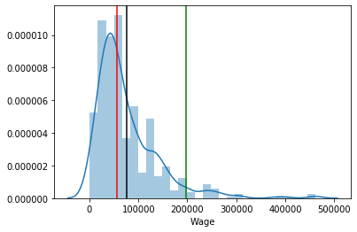


From this distribution plot we can observe that for most players there is a small deviation in their salary and 95% of them are earning under $200,000 a week. However, for the top 5% of players, their unique set skill set warants extreme wage compensation most likely due to the fact that these players may be seen as irreplacable talent.


```python
top5percent = float(df['Wage'].quantile(0.95))
top5 = df[df['Wage']>top5percent]
top5['Player']
```


    0                Alexis S‡nchez 
    1                    Mesut 
    zil 
    2               Gonzalo Higua’n 
    3                    Paul Pogba 
    4               Kevin De Bruyne 
    5                 Sergio AgŸero 
    6                   Eden Hazard 
    7                  David de Gea 
    8                    Harry Kane 
    9            Henrikh Mkhitaryan 
    10                Mohamed Salah 
    11                 Riyad Mahrez 
    12          Alexandre Lacazette 
    13                  Fernandinho 
    14             Nicol‡s Otamendi 
    15    Pierre-Emerick Aubameyang 
    16              Roberto Firmino 
    17                Romelu Lukaku 
    18              Virgil van Dijk 
    19                  David Silva 
    20                    Juan Mata 
    21                         Kepa 
    Name: Player, dtype: object


Now, let's look at how wage spending differs by club. It's interesting to see that only "Big 6" clubs had players whose wages were in the 95 percentile or higher. These seem to be the only clubs that can afford to pay the premium for high quality players.


```python
sns.catplot(y='Club', x="Wage", data=df, color='blue', alpha=0.7)
plt.axvline(df['Wage'].mean(), 0,1, color='black')
plt.axvline(df['Wage'].median(), 0,1, color='red')
plt.axvline(df['Wage'].quantile(0.95), 0,1, color='green')
```


    <matplotlib.lines.Line2D at 0x1a1ada5048>


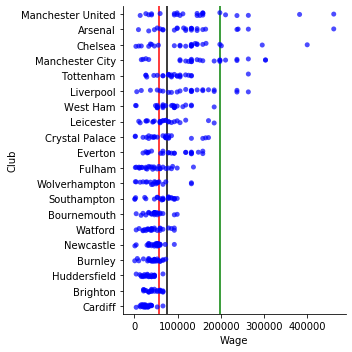


```python
club_wage_list = []
for club in df['Club'].unique():
    clubDf = df[df['Club']==club]
    wagebill = sum(clubDf['Wage'])
    maxwage = clubDf['Wage'].max()
    avg = int(clubDf['Wage'].mean())
    median = int(clubDf['Wage'].median())
    var = clubDf['Wage'].var()
    
    club_wage_list.append({'Club':club, 'Total Wages':wagebill, 'Max Wage':maxwage, 'Avg Wage':avg, 'Median Wage':median,
                          'Wage Variance':var})

wageBillDf = pd.DataFrame.from_dict(club_wage_list)
wageBillDf = wageBillDf.sort_values('Total Wages', ascending=False)
# wageBillDf.sort_values('Total Wages', ascending=False).reset_index(drop=True)
# wageBillDf.index += 1

wageBillDf
```


<div>
<style scoped>
    .dataframe tbody tr th:only-of-type {
        vertical-align: middle;
    }

    .dataframe tbody tr th {
        vertical-align: top;
    }

    .dataframe thead th {
        text-align: right;
    }
</style>
<table border="1" class="dataframe">
  <thead>
    <tr style="text-align: right;">
      <th></th>
      <th>Club</th>
      <th>Total Wages</th>
      <th>Max Wage</th>
      <th>Avg Wage</th>
      <th>Median Wage</th>
      <th>Wage Variance</th>
    </tr>
  </thead>
  <tbody>
    <tr>
      <th>3</th>
      <td>Manchester City</td>
      <td>3868632</td>
      <td>303624</td>
      <td>154745</td>
      <td>145126</td>
      <td>6.566530e+09</td>
    </tr>
    <tr>
      <th>0</th>
      <td>Manchester United</td>
      <td>3641352</td>
      <td>461765</td>
      <td>145654</td>
      <td>145126</td>
      <td>1.138996e+10</td>
    </tr>
    <tr>
      <th>1</th>
      <td>Arsenal</td>
      <td>3318621</td>
      <td>461765</td>
      <td>132744</td>
      <td>118740</td>
      <td>8.667877e+09</td>
    </tr>
    <tr>
      <th>2</th>
      <td>Chelsea</td>
      <td>3172430</td>
      <td>400290</td>
      <td>122016</td>
      <td>131793</td>
      <td>7.858050e+09</td>
    </tr>
    <tr>
      <th>5</th>
      <td>Liverpool</td>
      <td>2993558</td>
      <td>263866</td>
      <td>124731</td>
      <td>131933</td>
      <td>4.715142e+09</td>
    </tr>
    <tr>
      <th>4</th>
      <td>Tottenham</td>
      <td>2183970</td>
      <td>263866</td>
      <td>90998</td>
      <td>85756</td>
      <td>2.327486e+09</td>
    </tr>
    <tr>
      <th>6</th>
      <td>West Ham</td>
      <td>2069848</td>
      <td>184706</td>
      <td>79609</td>
      <td>79159</td>
      <td>1.496539e+09</td>
    </tr>
    <tr>
      <th>9</th>
      <td>Everton</td>
      <td>2030069</td>
      <td>158320</td>
      <td>88263</td>
      <td>85756</td>
      <td>2.071127e+09</td>
    </tr>
    <tr>
      <th>8</th>
      <td>Crystal Palace</td>
      <td>1797332</td>
      <td>171513</td>
      <td>69128</td>
      <td>72563</td>
      <td>2.037038e+09</td>
    </tr>
    <tr>
      <th>7</th>
      <td>Leicester</td>
      <td>1769933</td>
      <td>184706</td>
      <td>70797</td>
      <td>65966</td>
      <td>1.811540e+09</td>
    </tr>
    <tr>
      <th>12</th>
      <td>Southampton</td>
      <td>1457060</td>
      <td>98950</td>
      <td>60710</td>
      <td>65966</td>
      <td>8.958663e+08</td>
    </tr>
    <tr>
      <th>10</th>
      <td>Fulham</td>
      <td>1252325</td>
      <td>136652</td>
      <td>46382</td>
      <td>42219</td>
      <td>1.060711e+09</td>
    </tr>
    <tr>
      <th>15</th>
      <td>Newcastle</td>
      <td>1203635</td>
      <td>92353</td>
      <td>46293</td>
      <td>50135</td>
      <td>3.468090e+08</td>
    </tr>
    <tr>
      <th>14</th>
      <td>Watford</td>
      <td>1171516</td>
      <td>92353</td>
      <td>45058</td>
      <td>39580</td>
      <td>5.665106e+08</td>
    </tr>
    <tr>
      <th>13</th>
      <td>Bournemouth</td>
      <td>1117704</td>
      <td>98950</td>
      <td>46571</td>
      <td>46177</td>
      <td>4.368404e+08</td>
    </tr>
    <tr>
      <th>16</th>
      <td>Burnley</td>
      <td>1089388</td>
      <td>72563</td>
      <td>41899</td>
      <td>46177</td>
      <td>3.246100e+08</td>
    </tr>
    <tr>
      <th>18</th>
      <td>Brighton</td>
      <td>1004389</td>
      <td>65966</td>
      <td>43669</td>
      <td>39580</td>
      <td>2.397273e+08</td>
    </tr>
    <tr>
      <th>11</th>
      <td>Wolverhampton</td>
      <td>924646</td>
      <td>131933</td>
      <td>48665</td>
      <td>46177</td>
      <td>1.237018e+09</td>
    </tr>
    <tr>
      <th>17</th>
      <td>Huddersfield</td>
      <td>808068</td>
      <td>65966</td>
      <td>32322</td>
      <td>32983</td>
      <td>1.966270e+08</td>
    </tr>
    <tr>
      <th>19</th>
      <td>Cardiff</td>
      <td>781881</td>
      <td>65966</td>
      <td>27924</td>
      <td>25727</td>
      <td>1.550620e+08</td>
    </tr>
  </tbody>
</table>
</div>


Above we can see the PL table by total wage spending

Now lets add some performance statistics from the season


```python
#include GF & GA
prem_table_dict={'Manchester City':{'Table Pos':1, 'GD':72, 'GF':95, 'GA':23, 'Pts':98},
                'Liverpool':{'Table Pos':2, 'GD':67, 'GF':89, 'GA':22, 'Pts':97},
                'Chelsea':{'Table Pos':3, 'GD':24, 'GF':63, 'GA':39, 'Pts':72},
                'Tottenham':{'Table Pos':4, 'GD':28, 'GF':67, 'GA':39, 'Pts':71},
                'Arsenal':{'Table Pos':5, 'GD':22, 'GF':73, 'GA':51, 'Pts':70},
                'Manchester United':{'Table Pos':6, 'GD':65, 'GF':54, 'GA':23, 'Pts':66},
                'Wolverhampton':{'Table Pos':7, 'GD':1, 'GF':47, 'GA':46, 'Pts':57},
                'Everton':{'Table Pos':8, 'GD':8, 'GF':54, 'GA':46, 'Pts':54},
                'Leicester':{'Table Pos':9, 'GD':3, 'GF':51, 'GA':48, 'Pts':52},
                'West Ham':{'Table Pos':10, 'GD':-3, 'GF':52, 'GA':55, 'Pts':52},
                'Watford':{'Table Pos':11, 'GD':-7, 'GF':52, 'GA':59, 'Pts':50},
                'Crystal Palace':{'Table Pos':12, 'GD':-2, 'GF':51, 'GA':53, 'Pts':49},
                'Newcastle':{'Table Pos':13, 'GD':-6, 'GF':42, 'GA':48, 'Pts':45},
                'Bournemouth':{'Table Pos':14, 'GD':-14, 'GF':56, 'GA':70, 'Pts':45},
                'Burnley':{'Table Pos':15, 'GD':-23, 'GF':45, 'GA':68, 'Pts':40},
                'Southampton':{'Table Pos':16, 'GD':-20, 'GF':45, 'GA':65, 'Pts':39},
                'Brighton':{'Table Pos':17, 'GD':-25, 'GF':35, 'GA':60, 'Pts':36},
                'Cardiff':{'Table Pos':18, 'GD':-35, 'GF':34, 'GA':69, 'Pts':34},
                'Fulham':{'Table Pos':19, 'GD':-47, 'GF':34, 'GA':81, 'Pts':26},
                'Huddersfield':{'Table Pos':20, 'GD':-54, 'GF':22, 'GA':76, 'Pts':16}}
```


```python
wageBillDf['Table Position'] = 1
wageBillDf['Goal Difference'] = 1
wageBillDf['GF'] = 1
wageBillDf['GA'] = 1
wageBillDf['Points'] = 1


for index, row in wageBillDf.iterrows():
    club = wageBillDf['Club'][index]
    
    wageBillDf['Table Position'][index] = prem_table_dict[club]['Table Pos']
    wageBillDf['Goal Difference'][index] = prem_table_dict[club]['GD']
    wageBillDf['GF'][index] = prem_table_dict[club]['GF']
    wageBillDf['GA'][index] = prem_table_dict[club]['GA']
    wageBillDf['Points'][index] = prem_table_dict[club]['Pts']
    
wageBillDf
```


<div>
<style scoped>
    .dataframe tbody tr th:only-of-type {
        vertical-align: middle;
    }

    .dataframe tbody tr th {
        vertical-align: top;
    }

    .dataframe thead th {
        text-align: right;
    }
</style>
<table border="1" class="dataframe">
  <thead>
    <tr style="text-align: right;">
      <th></th>
      <th>Club</th>
      <th>Total Wages</th>
      <th>Max Wage</th>
      <th>Avg Wage</th>
      <th>Median Wage</th>
      <th>Wage Variance</th>
      <th>Table Position</th>
      <th>Goal Difference</th>
      <th>GF</th>
      <th>GA</th>
      <th>Points</th>
    </tr>
  </thead>
  <tbody>
    <tr>
      <th>3</th>
      <td>Manchester City</td>
      <td>3868632</td>
      <td>303624</td>
      <td>154745</td>
      <td>145126</td>
      <td>6.566530e+09</td>
      <td>1</td>
      <td>72</td>
      <td>95</td>
      <td>23</td>
      <td>98</td>
    </tr>
    <tr>
      <th>0</th>
      <td>Manchester United</td>
      <td>3641352</td>
      <td>461765</td>
      <td>145654</td>
      <td>145126</td>
      <td>1.138996e+10</td>
      <td>6</td>
      <td>65</td>
      <td>54</td>
      <td>23</td>
      <td>66</td>
    </tr>
    <tr>
      <th>1</th>
      <td>Arsenal</td>
      <td>3318621</td>
      <td>461765</td>
      <td>132744</td>
      <td>118740</td>
      <td>8.667877e+09</td>
      <td>5</td>
      <td>22</td>
      <td>73</td>
      <td>51</td>
      <td>70</td>
    </tr>
    <tr>
      <th>2</th>
      <td>Chelsea</td>
      <td>3172430</td>
      <td>400290</td>
      <td>122016</td>
      <td>131793</td>
      <td>7.858050e+09</td>
      <td>3</td>
      <td>24</td>
      <td>63</td>
      <td>39</td>
      <td>72</td>
    </tr>
    <tr>
      <th>5</th>
      <td>Liverpool</td>
      <td>2993558</td>
      <td>263866</td>
      <td>124731</td>
      <td>131933</td>
      <td>4.715142e+09</td>
      <td>2</td>
      <td>67</td>
      <td>89</td>
      <td>22</td>
      <td>97</td>
    </tr>
    <tr>
      <th>4</th>
      <td>Tottenham</td>
      <td>2183970</td>
      <td>263866</td>
      <td>90998</td>
      <td>85756</td>
      <td>2.327486e+09</td>
      <td>4</td>
      <td>28</td>
      <td>67</td>
      <td>39</td>
      <td>71</td>
    </tr>
    <tr>
      <th>6</th>
      <td>West Ham</td>
      <td>2069848</td>
      <td>184706</td>
      <td>79609</td>
      <td>79159</td>
      <td>1.496539e+09</td>
      <td>10</td>
      <td>-3</td>
      <td>52</td>
      <td>55</td>
      <td>52</td>
    </tr>
    <tr>
      <th>9</th>
      <td>Everton</td>
      <td>2030069</td>
      <td>158320</td>
      <td>88263</td>
      <td>85756</td>
      <td>2.071127e+09</td>
      <td>8</td>
      <td>8</td>
      <td>54</td>
      <td>46</td>
      <td>54</td>
    </tr>
    <tr>
      <th>8</th>
      <td>Crystal Palace</td>
      <td>1797332</td>
      <td>171513</td>
      <td>69128</td>
      <td>72563</td>
      <td>2.037038e+09</td>
      <td>12</td>
      <td>-2</td>
      <td>51</td>
      <td>53</td>
      <td>49</td>
    </tr>
    <tr>
      <th>7</th>
      <td>Leicester</td>
      <td>1769933</td>
      <td>184706</td>
      <td>70797</td>
      <td>65966</td>
      <td>1.811540e+09</td>
      <td>9</td>
      <td>3</td>
      <td>51</td>
      <td>48</td>
      <td>52</td>
    </tr>
    <tr>
      <th>12</th>
      <td>Southampton</td>
      <td>1457060</td>
      <td>98950</td>
      <td>60710</td>
      <td>65966</td>
      <td>8.958663e+08</td>
      <td>16</td>
      <td>-20</td>
      <td>45</td>
      <td>65</td>
      <td>39</td>
    </tr>
    <tr>
      <th>10</th>
      <td>Fulham</td>
      <td>1252325</td>
      <td>136652</td>
      <td>46382</td>
      <td>42219</td>
      <td>1.060711e+09</td>
      <td>19</td>
      <td>-47</td>
      <td>34</td>
      <td>81</td>
      <td>26</td>
    </tr>
    <tr>
      <th>15</th>
      <td>Newcastle</td>
      <td>1203635</td>
      <td>92353</td>
      <td>46293</td>
      <td>50135</td>
      <td>3.468090e+08</td>
      <td>13</td>
      <td>-6</td>
      <td>42</td>
      <td>48</td>
      <td>45</td>
    </tr>
    <tr>
      <th>14</th>
      <td>Watford</td>
      <td>1171516</td>
      <td>92353</td>
      <td>45058</td>
      <td>39580</td>
      <td>5.665106e+08</td>
      <td>11</td>
      <td>-7</td>
      <td>52</td>
      <td>59</td>
      <td>50</td>
    </tr>
    <tr>
      <th>13</th>
      <td>Bournemouth</td>
      <td>1117704</td>
      <td>98950</td>
      <td>46571</td>
      <td>46177</td>
      <td>4.368404e+08</td>
      <td>14</td>
      <td>-14</td>
      <td>56</td>
      <td>70</td>
      <td>45</td>
    </tr>
    <tr>
      <th>16</th>
      <td>Burnley</td>
      <td>1089388</td>
      <td>72563</td>
      <td>41899</td>
      <td>46177</td>
      <td>3.246100e+08</td>
      <td>15</td>
      <td>-23</td>
      <td>45</td>
      <td>68</td>
      <td>40</td>
    </tr>
    <tr>
      <th>18</th>
      <td>Brighton</td>
      <td>1004389</td>
      <td>65966</td>
      <td>43669</td>
      <td>39580</td>
      <td>2.397273e+08</td>
      <td>17</td>
      <td>-25</td>
      <td>35</td>
      <td>60</td>
      <td>36</td>
    </tr>
    <tr>
      <th>11</th>
      <td>Wolverhampton</td>
      <td>924646</td>
      <td>131933</td>
      <td>48665</td>
      <td>46177</td>
      <td>1.237018e+09</td>
      <td>7</td>
      <td>1</td>
      <td>47</td>
      <td>46</td>
      <td>57</td>
    </tr>
    <tr>
      <th>17</th>
      <td>Huddersfield</td>
      <td>808068</td>
      <td>65966</td>
      <td>32322</td>
      <td>32983</td>
      <td>1.966270e+08</td>
      <td>20</td>
      <td>-54</td>
      <td>22</td>
      <td>76</td>
      <td>16</td>
    </tr>
    <tr>
      <th>19</th>
      <td>Cardiff</td>
      <td>781881</td>
      <td>65966</td>
      <td>27924</td>
      <td>25727</td>
      <td>1.550620e+08</td>
      <td>18</td>
      <td>-35</td>
      <td>34</td>
      <td>69</td>
      <td>34</td>
    </tr>
  </tbody>
</table>
</div>


Now that we have wage and performance information in the same data frame, let's explore some questions.

    What was the biggest determinant of table position? Points? Goal Difference?
    Did wage spending have anything to with success?
    


```python
wageBillDf.corr().abs()
```


<div>
<style scoped>
    .dataframe tbody tr th:only-of-type {
        vertical-align: middle;
    }

    .dataframe tbody tr th {
        vertical-align: top;
    }

    .dataframe thead th {
        text-align: right;
    }
</style>
<table border="1" class="dataframe">
  <thead>
    <tr style="text-align: right;">
      <th></th>
      <th>Total Wages</th>
      <th>Max Wage</th>
      <th>Avg Wage</th>
      <th>Median Wage</th>
      <th>Wage Variance</th>
      <th>Table Position</th>
      <th>Goal Difference</th>
      <th>GF</th>
      <th>GA</th>
      <th>Points</th>
    </tr>
  </thead>
  <tbody>
    <tr>
      <th>Total Wages</th>
      <td>1.000000</td>
      <td>0.923126</td>
      <td>0.994805</td>
      <td>0.986403</td>
      <td>0.919590</td>
      <td>0.827746</td>
      <td>0.886785</td>
      <td>0.809541</td>
      <td>0.804407</td>
      <td>0.838784</td>
    </tr>
    <tr>
      <th>Max Wage</th>
      <td>0.923126</td>
      <td>1.000000</td>
      <td>0.916580</td>
      <td>0.901135</td>
      <td>0.966205</td>
      <td>0.770833</td>
      <td>0.772402</td>
      <td>0.651439</td>
      <td>0.696679</td>
      <td>0.711055</td>
    </tr>
    <tr>
      <th>Avg Wage</th>
      <td>0.994805</td>
      <td>0.916580</td>
      <td>1.000000</td>
      <td>0.989712</td>
      <td>0.912681</td>
      <td>0.856040</td>
      <td>0.909895</td>
      <td>0.827769</td>
      <td>0.834241</td>
      <td>0.862994</td>
    </tr>
    <tr>
      <th>Median Wage</th>
      <td>0.986403</td>
      <td>0.901135</td>
      <td>0.989712</td>
      <td>1.000000</td>
      <td>0.905020</td>
      <td>0.848186</td>
      <td>0.909570</td>
      <td>0.813258</td>
      <td>0.845079</td>
      <td>0.859039</td>
    </tr>
    <tr>
      <th>Wage Variance</th>
      <td>0.919590</td>
      <td>0.966205</td>
      <td>0.912681</td>
      <td>0.905020</td>
      <td>1.000000</td>
      <td>0.706879</td>
      <td>0.777863</td>
      <td>0.603769</td>
      <td>0.703839</td>
      <td>0.676704</td>
    </tr>
    <tr>
      <th>Table Position</th>
      <td>0.827746</td>
      <td>0.770833</td>
      <td>0.856040</td>
      <td>0.848186</td>
      <td>0.706879</td>
      <td>1.000000</td>
      <td>0.922939</td>
      <td>0.885789</td>
      <td>0.903757</td>
      <td>0.953902</td>
    </tr>
    <tr>
      <th>Goal Difference</th>
      <td>0.886785</td>
      <td>0.772402</td>
      <td>0.909895</td>
      <td>0.909570</td>
      <td>0.777863</td>
      <td>0.922939</td>
      <td>1.000000</td>
      <td>0.883240</td>
      <td>0.961557</td>
      <td>0.952840</td>
    </tr>
    <tr>
      <th>GF</th>
      <td>0.809541</td>
      <td>0.651439</td>
      <td>0.827769</td>
      <td>0.813258</td>
      <td>0.603769</td>
      <td>0.885789</td>
      <td>0.883240</td>
      <td>1.000000</td>
      <td>0.776680</td>
      <td>0.962568</td>
    </tr>
    <tr>
      <th>GA</th>
      <td>0.804407</td>
      <td>0.696679</td>
      <td>0.834241</td>
      <td>0.845079</td>
      <td>0.703839</td>
      <td>0.903757</td>
      <td>0.961557</td>
      <td>0.776680</td>
      <td>1.000000</td>
      <td>0.902574</td>
    </tr>
    <tr>
      <th>Points</th>
      <td>0.838784</td>
      <td>0.711055</td>
      <td>0.862994</td>
      <td>0.859039</td>
      <td>0.676704</td>
      <td>0.953902</td>
      <td>0.952840</td>
      <td>0.962568</td>
      <td>0.902574</td>
      <td>1.000000</td>
    </tr>
  </tbody>
</table>
</div>


Below is the regression for causal effect of total wages on table position


```python
sns.regplot(y='Table Position', x='Total Wages', data=wageBillDf)
# np.polyfit( wageBillDf['Total Wages'], wageBillDf['Table Position'], 1)
```


    <matplotlib.axes._subplots.AxesSubplot at 0x1a1ad28d30>


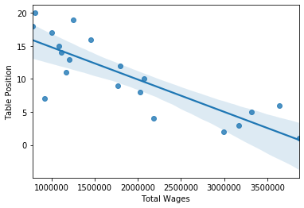


Regression of Total wages on Points


```python
sns.regplot(y='Points', x='Total Wages', data=wageBillDf)
np.polyfit(wageBillDf['Total Wages'], wageBillDf['Points'], 1)
```


    array([1.76302209e-05, 2.02555053e+01])


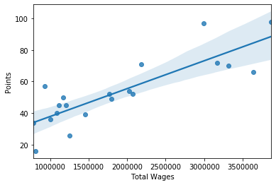


Regress total wages on Goal difference


```python
sns.regplot(y='Goal Difference', x='Total Wages', data=wageBillDf, order=2) #order?
np.polyfit(wageBillDf['Total Wages'], wageBillDf['Goal Difference'], 1)
```


    array([ 3.14474545e-05, -5.65098286e+01])


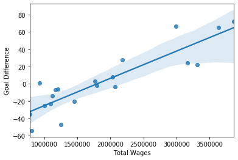


```python

```


```python

```


```python

```


```python


```

## Successful and Unsuccessful club analysis

Now we will look at the three clubs how furthest positively deviated away from our model

Spending was most correlated with points won, more continuous than final position

Lets revisit that graph


```python
#maybe this is a second order relation? there should be diminishing marginal returns on dollar/point
fig, (ax1, ax2) = plt.subplots(1, 2)
ax1 = sns.regplot(y='Goal Difference', x='Total Wages', data=wageBillDf)
ax2 = sns.residplot(x='Total Wages', y='Goal Difference', data=wageBillDf)
np.polyfit(wageBillDf['Total Wages'], wageBillDf['Points'], 1)
```


    array([1.76302209e-05, 2.02555053e+01])


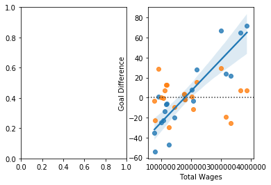


Ok wage spend has significant impact on goal differential and finishing position, but in spite of spending, who performed the best


```python
sns.residplot(x='Total Wages', y='Goal Difference', data=wageBillDf)
```


    <matplotlib.axes._subplots.AxesSubplot at 0x1a1b265588>


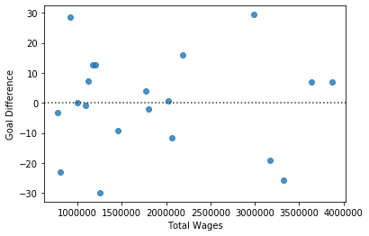


Highest resid...wolves, liverpool, tottenham
Lowest resid... arsenal, huddersfield, fulham


```python
# big6 = ['Arsenal', 'Chelsea', 'Liverpool', 'Manchester City', 'Manchester United', 'Tottenham']
# bestSpendEff = ['Liverpool', 'Tottenham', 'Wolverhampton']
# worstSpendEff = ['Arsenal', 'Fulham', 'Huddersfield']

# wageBillDf['Big 6'] = 0
# wageBillDf['Spend Eff'] = 0

# for index, row in wageBillDf.iterrows():
#     club = wageBillDf['Club'][index]
    
#     if club in big6:
#         wageBillDf['Big 6'][index] = 1
    
#     if club in bestSpendEff:
#         wageBillDf['Spend Eff'][index] = 1
    
#     if club in worstSpendEff:
#         wageBillDf['Spend Eff'][index] = 2
```


```python
club = df[df['Club']=='Liverpool']
starters = sum(club[club['Status']=='Starter']['Wage'])
reserve = sum(club[club['Status']=='Reserve']['Wage'])
plt.pie([starters, reserve])
```


    ([<matplotlib.patches.Wedge at 0x1a1b2285c0>,
      <matplotlib.patches.Wedge at 0x1a1b228a58>],
     [Text(-0.10417113365593648, 1.0950563341275357, ''),
      Text(0.10417123618250897, -1.0950563243743254, '')])


```python
club = df[df['Club']=='Liverpool']
f = sum(club[club['Pos Class']=='F']['Wage'])
m = sum(club[club['Pos Class']=='M']['Wage'])
d = sum(club[club['Pos Class']=='D']['Wage'])
gk = sum(club[club['Pos Class']=='GK']['Wage'])
att = f + m
defe = d + gk
plt.pie([att, defe])
```


    ([<matplotlib.patches.Wedge at 0x1a1b841668>,
      <matplotlib.patches.Wedge at 0x1a1b841b00>],
     [Text(-0.6010398635155904, 0.9212768761155143, ''),
      Text(0.6010398635155902, -0.9212768761155145, '')])


```python
club = df[df['Club']=='Liverpool']
f = club[club['Pos Class']=='F']['Wage'].mean()
m = club[club['Pos Class']=='M']['Wage'].mean()
d = club[club['Pos Class']=='D']['Wage'].mean()
gk = club[club['Pos Class']=='GK']['Wage'].mean()

att = (f+m)/2
defe = (d+gk)/2
plt.pie([att, defe])
```


    ([<matplotlib.patches.Wedge at 0x1a1b717e80>,
      <matplotlib.patches.Wedge at 0x1a1b93e358>],
     [Text(-0.3502797451558995, 1.0427387497036438, ''),
      Text(0.3502797451558996, -1.0427387497036438, '')])


```python
sns.scatterplot(y= wageBillDf['GA'], x=wageBillDf['Total Wages'], data=wageBillDf, hue=wageBillDf['Spend Eff'])
```


    <matplotlib.axes._subplots.AxesSubplot at 0x1a23b8d470>


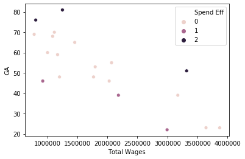


```python
winners = df[(df['Club'] == 'Wolverhampton')|(df['Club'] == 'Liverpool')|(df['Club'] == 'Tottenham')]
```


```python
club_wage_list = []
for club in df['Club'].unique():
    clubDf = df[df['Club']==club]
    wagebill = sum(clubDf['Wage'])
    maxwage = clubDf['Wage'].max()
    avg = clubDf['Wage'].mean()
    median = clubDf['Wage'].median()
    var = clubDf['Wage'].var()
    
    club_wage_list.append({'Club':club, 'Total Wages':wagebill, 'Max Wage':maxwage, 'Avg Wage':avg, 'Median Wage':median,
                          'Wage Variance':var})

wageBillDf = pd.DataFrame.from_dict(club_wage_list)
wageBillDf = wageBillDf.sort_values('Total Wages', ascending=False)
# wageBillDf.sort_values('Total Wages', ascending=False).reset_index(drop=True)
# wageBillDf.index += 1

wageBillDf
```


```python
arsenal = df[df['Club']=='Arsenal']
arsenal
```


<div>
<style scoped>
    .dataframe tbody tr th:only-of-type {
        vertical-align: middle;
    }

    .dataframe tbody tr th {
        vertical-align: top;
    }

    .dataframe thead th {
        text-align: right;
    }
</style>
<table border="1" class="dataframe">
  <thead>
    <tr style="text-align: right;">
      <th></th>
      <th>Rank</th>
      <th>Player</th>
      <th>Wage</th>
      <th>Pos.</th>
      <th>Age</th>
      <th>Status</th>
      <th>Length (Yrs)</th>
      <th>Salary</th>
      <th>Club</th>
      <th>Pos Class</th>
    </tr>
  </thead>
  <tbody>
    <tr>
      <th>1</th>
      <td>2</td>
      <td>Mesut …zil</td>
      <td>461765</td>
      <td>AM</td>
      <td>30</td>
      <td>Starter</td>
      <td>3</td>
      <td>24011806</td>
      <td>Arsenal</td>
      <td>M</td>
    </tr>
    <tr>
      <th>9</th>
      <td>10</td>
      <td>Henrikh Mkhitaryan</td>
      <td>263866</td>
      <td>AM</td>
      <td>30</td>
      <td>Reserve</td>
      <td>3</td>
      <td>13721032</td>
      <td>Arsenal</td>
      <td>M</td>
    </tr>
    <tr>
      <th>12</th>
      <td>13</td>
      <td>Alexandre Lacazette</td>
      <td>240220</td>
      <td>CF</td>
      <td>27</td>
      <td>Starter</td>
      <td>4</td>
      <td>12491416</td>
      <td>Arsenal</td>
      <td>F</td>
    </tr>
    <tr>
      <th>15</th>
      <td>16</td>
      <td>Pierre-Emerick Aubameyang</td>
      <td>237479</td>
      <td>CF</td>
      <td>29</td>
      <td>Starter</td>
      <td>3</td>
      <td>12348929</td>
      <td>Arsenal</td>
      <td>F</td>
    </tr>
    <tr>
      <th>36</th>
      <td>37</td>
      <td>Danny Welbeck</td>
      <td>164916</td>
      <td>CF</td>
      <td>28</td>
      <td>Reserve</td>
      <td>1</td>
      <td>8575645</td>
      <td>Arsenal</td>
      <td>F</td>
    </tr>
    <tr>
      <th>38</th>
      <td>39</td>
      <td>Aaron Ramsey</td>
      <td>158320</td>
      <td>CM</td>
      <td>28</td>
      <td>Starter</td>
      <td>1</td>
      <td>8232619</td>
      <td>Arsenal</td>
      <td>M</td>
    </tr>
    <tr>
      <th>55</th>
      <td>56</td>
      <td>HŽctor Beller’n</td>
      <td>145126</td>
      <td>RB</td>
      <td>24</td>
      <td>Starter</td>
      <td>5</td>
      <td>7546568</td>
      <td>Arsenal</td>
      <td>D</td>
    </tr>
    <tr>
      <th>60</th>
      <td>61</td>
      <td>Petr Cech</td>
      <td>145126</td>
      <td>GK</td>
      <td>36</td>
      <td>Starter</td>
      <td>1</td>
      <td>7546568</td>
      <td>Arsenal</td>
      <td>GK</td>
    </tr>
    <tr>
      <th>65</th>
      <td>66</td>
      <td>Bernd Leno</td>
      <td>131933</td>
      <td>GK</td>
      <td>27</td>
      <td>Reserve</td>
      <td>5</td>
      <td>6860516</td>
      <td>Arsenal</td>
      <td>GK</td>
    </tr>
    <tr>
      <th>72</th>
      <td>73</td>
      <td>Granit Xhaka</td>
      <td>131933</td>
      <td>DM</td>
      <td>26</td>
      <td>Starter</td>
      <td>5</td>
      <td>6860516</td>
      <td>Arsenal</td>
      <td>M</td>
    </tr>
    <tr>
      <th>87</th>
      <td>88</td>
      <td>Sead Kolasinac</td>
      <td>131933</td>
      <td>LB</td>
      <td>25</td>
      <td>Reserve</td>
      <td>4</td>
      <td>6860516</td>
      <td>Arsenal</td>
      <td>D</td>
    </tr>
    <tr>
      <th>88</th>
      <td>89</td>
      <td>Sokratis</td>
      <td>131933</td>
      <td>CB</td>
      <td>30</td>
      <td>Starter</td>
      <td>3</td>
      <td>6860516</td>
      <td>Arsenal</td>
      <td>D</td>
    </tr>
    <tr>
      <th>98</th>
      <td>99</td>
      <td>Laurent Koscielny</td>
      <td>118740</td>
      <td>CB</td>
      <td>33</td>
      <td>Reserve</td>
      <td>2</td>
      <td>6174464</td>
      <td>Arsenal</td>
      <td>D</td>
    </tr>
    <tr>
      <th>101</th>
      <td>102</td>
      <td>Shkodran Mustafi</td>
      <td>118740</td>
      <td>CB</td>
      <td>26</td>
      <td>Starter</td>
      <td>3</td>
      <td>6174464</td>
      <td>Arsenal</td>
      <td>D</td>
    </tr>
    <tr>
      <th>103</th>
      <td>104</td>
      <td>Denis Su‡rez</td>
      <td>113868</td>
      <td>CM</td>
      <td>25</td>
      <td>Reserve</td>
      <td>1</td>
      <td>5921153</td>
      <td>Arsenal</td>
      <td>M</td>
    </tr>
    <tr>
      <th>122</th>
      <td>123</td>
      <td>Lucas Torreira</td>
      <td>98950</td>
      <td>DM</td>
      <td>23</td>
      <td>Reserve</td>
      <td>5</td>
      <td>5145387</td>
      <td>Arsenal</td>
      <td>M</td>
    </tr>
    <tr>
      <th>126</th>
      <td>127</td>
      <td>Stephan Lichtsteiner</td>
      <td>98950</td>
      <td>RB</td>
      <td>35</td>
      <td>Reserve</td>
      <td>1</td>
      <td>5145387</td>
      <td>Arsenal</td>
      <td>D</td>
    </tr>
    <tr>
      <th>141</th>
      <td>142</td>
      <td>Nacho Monreal</td>
      <td>92353</td>
      <td>LB</td>
      <td>33</td>
      <td>Starter</td>
      <td>1</td>
      <td>4802361</td>
      <td>Arsenal</td>
      <td>D</td>
    </tr>
    <tr>
      <th>195</th>
      <td>196</td>
      <td>Alex Iwobi</td>
      <td>65966</td>
      <td>LW</td>
      <td>22</td>
      <td>Reserve</td>
      <td>4</td>
      <td>3430258</td>
      <td>Arsenal</td>
      <td>F</td>
    </tr>
    <tr>
      <th>211</th>
      <td>212</td>
      <td>Mohamed Elneny</td>
      <td>65966</td>
      <td>DM</td>
      <td>26</td>
      <td>Reserve</td>
      <td>4</td>
      <td>3430258</td>
      <td>Arsenal</td>
      <td>M</td>
    </tr>
    <tr>
      <th>225</th>
      <td>226</td>
      <td>Carl Jenkinson</td>
      <td>59370</td>
      <td>RB</td>
      <td>27</td>
      <td>Reserve</td>
      <td>1</td>
      <td>3087232</td>
      <td>Arsenal</td>
      <td>D</td>
    </tr>
    <tr>
      <th>268</th>
      <td>269</td>
      <td>MattŽo Guendouzi</td>
      <td>52773</td>
      <td>CM</td>
      <td>19</td>
      <td>Starter</td>
      <td>4</td>
      <td>2744206</td>
      <td>Arsenal</td>
      <td>M</td>
    </tr>
    <tr>
      <th>290</th>
      <td>291</td>
      <td>Ainsley Maitland-Niles</td>
      <td>46177</td>
      <td>RM</td>
      <td>21</td>
      <td>Reserve</td>
      <td>5</td>
      <td>2401181</td>
      <td>Arsenal</td>
      <td>M</td>
    </tr>
    <tr>
      <th>385</th>
      <td>386</td>
      <td>Rob Holding</td>
      <td>32983</td>
      <td>CB</td>
      <td>23</td>
      <td>Reserve</td>
      <td>5</td>
      <td>1715129</td>
      <td>Arsenal</td>
      <td>D</td>
    </tr>
    <tr>
      <th>475</th>
      <td>476</td>
      <td>Konstantinos Mavropanos</td>
      <td>9235</td>
      <td>CB</td>
      <td>21</td>
      <td>Reserve</td>
      <td>5</td>
      <td>480236</td>
      <td>Arsenal</td>
      <td>D</td>
    </tr>
  </tbody>
</table>
</div>


```python
positional_spending = []
for club in df['Club'].unique():
    clubDf = df[df['Club']==club]
    Fdf = clubDf[clubDf['Pos Class']=='F']
    Ddf = clubDf[clubDf['Pos Class']=='D']
    GKdf = clubDf[clubDf['Pos Class']=='GK']
    
    fwage = sum(Fdf['Wage'])
    fplayers = len(Fdf['Wage'])
    dwage = sum(Ddf['Wage']) + sum(GKdf['Wage'])
    dplayers = len(Ddf['Wage']) + len(GKdf['Wage'])
    
    positional_spending.append({'Club':club, 'Forwards':fplayers, 'Forward Spend':fwage, 'Defenders':dplayers, 'Defense Spend':dwage})
    
positional_spend = pd.DataFrame.from_dict(positional_spending)
positional_spend
```


<div>
<style scoped>
    .dataframe tbody tr th:only-of-type {
        vertical-align: middle;
    }

    .dataframe tbody tr th {
        vertical-align: top;
    }

    .dataframe thead th {
        text-align: right;
    }
</style>
<table border="1" class="dataframe">
  <thead>
    <tr style="text-align: right;">
      <th></th>
      <th>Club</th>
      <th>Forwards</th>
      <th>Forward Spend</th>
      <th>Defenders</th>
      <th>Defense Spend</th>
    </tr>
  </thead>
  <tbody>
    <tr>
      <th>0</th>
      <td>Manchester United</td>
      <td>5</td>
      <td>969707</td>
      <td>13</td>
      <td>1556810</td>
    </tr>
    <tr>
      <th>1</th>
      <td>Arsenal</td>
      <td>4</td>
      <td>708581</td>
      <td>12</td>
      <td>1216422</td>
    </tr>
    <tr>
      <th>2</th>
      <td>Chelsea</td>
      <td>6</td>
      <td>1134776</td>
      <td>13</td>
      <td>1206907</td>
    </tr>
    <tr>
      <th>3</th>
      <td>Manchester City</td>
      <td>6</td>
      <td>1207366</td>
      <td>13</td>
      <td>1602986</td>
    </tr>
    <tr>
      <th>4</th>
      <td>Tottenham</td>
      <td>6</td>
      <td>744101</td>
      <td>12</td>
      <td>872558</td>
    </tr>
    <tr>
      <th>5</th>
      <td>Liverpool</td>
      <td>7</td>
      <td>985539</td>
      <td>10</td>
      <td>945958</td>
    </tr>
    <tr>
      <th>6</th>
      <td>West Ham</td>
      <td>10</td>
      <td>889051</td>
      <td>10</td>
      <td>748058</td>
    </tr>
    <tr>
      <th>7</th>
      <td>Leicester</td>
      <td>5</td>
      <td>441976</td>
      <td>11</td>
      <td>894506</td>
    </tr>
    <tr>
      <th>8</th>
      <td>Crystal Palace</td>
      <td>7</td>
      <td>598317</td>
      <td>14</td>
      <td>729335</td>
    </tr>
    <tr>
      <th>9</th>
      <td>Everton</td>
      <td>6</td>
      <td>544885</td>
      <td>11</td>
      <td>881972</td>
    </tr>
    <tr>
      <th>10</th>
      <td>Fulham</td>
      <td>6</td>
      <td>454865</td>
      <td>12</td>
      <td>449716</td>
    </tr>
    <tr>
      <th>11</th>
      <td>Wolverhampton</td>
      <td>5</td>
      <td>263510</td>
      <td>9</td>
      <td>382200</td>
    </tr>
    <tr>
      <th>12</th>
      <td>Southampton</td>
      <td>8</td>
      <td>506091</td>
      <td>11</td>
      <td>588155</td>
    </tr>
    <tr>
      <th>13</th>
      <td>Bournemouth</td>
      <td>7</td>
      <td>313341</td>
      <td>11</td>
      <td>553689</td>
    </tr>
    <tr>
      <th>14</th>
      <td>Watford</td>
      <td>5</td>
      <td>320546</td>
      <td>13</td>
      <td>464406</td>
    </tr>
    <tr>
      <th>15</th>
      <td>Newcastle</td>
      <td>5</td>
      <td>255950</td>
      <td>13</td>
      <td>565055</td>
    </tr>
    <tr>
      <th>16</th>
      <td>Burnley</td>
      <td>8</td>
      <td>311642</td>
      <td>13</td>
      <td>534988</td>
    </tr>
    <tr>
      <th>17</th>
      <td>Huddersfield</td>
      <td>6</td>
      <td>193258</td>
      <td>11</td>
      <td>328515</td>
    </tr>
    <tr>
      <th>18</th>
      <td>Brighton</td>
      <td>6</td>
      <td>323236</td>
      <td>11</td>
      <td>410691</td>
    </tr>
    <tr>
      <th>19</th>
      <td>Cardiff</td>
      <td>7</td>
      <td>212412</td>
      <td>11</td>
      <td>287613</td>
    </tr>
  </tbody>
</table>
</div>


```python
df
```


<div>
<style scoped>
    .dataframe tbody tr th:only-of-type {
        vertical-align: middle;
    }

    .dataframe tbody tr th {
        vertical-align: top;
    }

    .dataframe thead th {
        text-align: right;
    }
</style>
<table border="1" class="dataframe">
  <thead>
    <tr style="text-align: right;">
      <th></th>
      <th>Rank</th>
      <th>Player</th>
      <th>Wage</th>
      <th>Pos.</th>
      <th>Age</th>
      <th>Status</th>
      <th>Length (Yrs)</th>
      <th>Salary</th>
      <th>Club</th>
      <th>Pos Class</th>
    </tr>
  </thead>
  <tbody>
    <tr>
      <th>0</th>
      <td>1</td>
      <td>Alexis S‡nchez</td>
      <td>461765</td>
      <td>LW</td>
      <td>30</td>
      <td>Reserve</td>
      <td>4</td>
      <td>24011806</td>
      <td>Manchester United</td>
      <td>F</td>
    </tr>
    <tr>
      <th>1</th>
      <td>2</td>
      <td>Mesut …zil</td>
      <td>461765</td>
      <td>AM</td>
      <td>30</td>
      <td>Starter</td>
      <td>3</td>
      <td>24011806</td>
      <td>Arsenal</td>
      <td>M</td>
    </tr>
    <tr>
      <th>2</th>
      <td>3</td>
      <td>Gonzalo Higua’n</td>
      <td>400290</td>
      <td>CF</td>
      <td>31</td>
      <td>Reserve</td>
      <td>1</td>
      <td>20815069</td>
      <td>Chelsea</td>
      <td>F</td>
    </tr>
    <tr>
      <th>3</th>
      <td>4</td>
      <td>Paul Pogba</td>
      <td>382606</td>
      <td>CM</td>
      <td>26</td>
      <td>Starter</td>
      <td>3</td>
      <td>19895496</td>
      <td>Manchester United</td>
      <td>M</td>
    </tr>
    <tr>
      <th>4</th>
      <td>5</td>
      <td>Kevin De Bruyne</td>
      <td>303624</td>
      <td>AM</td>
      <td>27</td>
      <td>Starter</td>
      <td>5</td>
      <td>15788422</td>
      <td>Manchester City</td>
      <td>M</td>
    </tr>
    <tr>
      <th>...</th>
      <td>...</td>
      <td>...</td>
      <td>...</td>
      <td>...</td>
      <td>...</td>
      <td>...</td>
      <td>...</td>
      <td>...</td>
      <td>...</td>
      <td>...</td>
    </tr>
    <tr>
      <th>492</th>
      <td>493</td>
      <td>Lucas Perri</td>
      <td>1725</td>
      <td>GK</td>
      <td>21</td>
      <td>Reserve</td>
      <td>1</td>
      <td>89714</td>
      <td>Crystal Palace</td>
      <td>GK</td>
    </tr>
    <tr>
      <th>493</th>
      <td>494</td>
      <td>Jack Rose</td>
      <td>1053</td>
      <td>GK</td>
      <td>24</td>
      <td>Reserve</td>
      <td>2</td>
      <td>54752</td>
      <td>Southampton</td>
      <td>GK</td>
    </tr>
    <tr>
      <th>494</th>
      <td>495</td>
      <td>Sean Longstaff</td>
      <td>913</td>
      <td>CM</td>
      <td>21</td>
      <td>Reserve</td>
      <td>4</td>
      <td>47496</td>
      <td>Newcastle</td>
      <td>M</td>
    </tr>
    <tr>
      <th>495</th>
      <td>496</td>
      <td>Michael Obafemi</td>
      <td>787</td>
      <td>CF</td>
      <td>18</td>
      <td>Reserve</td>
      <td>4</td>
      <td>40899</td>
      <td>Southampton</td>
      <td>F</td>
    </tr>
    <tr>
      <th>496</th>
      <td>497</td>
      <td>Dwight McNeil</td>
      <td>660</td>
      <td>LW</td>
      <td>19</td>
      <td>Reserve</td>
      <td>5</td>
      <td>34303</td>
      <td>Burnley</td>
      <td>F</td>
    </tr>
  </tbody>
</table>
<p>497 rows × 10 columns</p>
</div>


```python

```


```python
#winners
```


```python
sns.regplot()
```


```python
sns.catplot(y='Club', x="Wage", data=winners, hue='Pos Class')
```


    <seaborn.axisgrid.FacetGrid at 0x1a21cc1a20>


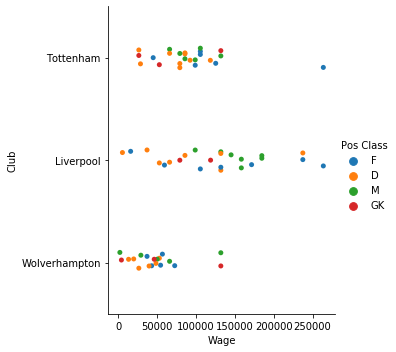


Let's look at wolves


```python
wolves = df[df['Club']=='Wolverhampton']
```


```python
wolves
```


<div>
<style scoped>
    .dataframe tbody tr th:only-of-type {
        vertical-align: middle;
    }

    .dataframe tbody tr th {
        vertical-align: top;
    }

    .dataframe thead th {
        text-align: right;
    }
</style>
<table border="1" class="dataframe">
  <thead>
    <tr style="text-align: right;">
      <th></th>
      <th>Rank</th>
      <th>Player</th>
      <th>Wage</th>
      <th>Pos.</th>
      <th>Age</th>
      <th>Status</th>
      <th>Length (Yrs)</th>
      <th>Salary</th>
      <th>Club</th>
      <th>Pos Class</th>
    </tr>
  </thead>
  <tbody>
    <tr>
      <th>79</th>
      <td>80</td>
      <td>Jo‹o Moutinho</td>
      <td>131933</td>
      <td>CM</td>
      <td>32</td>
      <td>Starter</td>
      <td>2</td>
      <td>6860516</td>
      <td>Wolverhampton</td>
      <td>M</td>
    </tr>
    <tr>
      <th>85</th>
      <td>86</td>
      <td>Rui Patr’cio</td>
      <td>131933</td>
      <td>GK</td>
      <td>31</td>
      <td>Starter</td>
      <td>4</td>
      <td>6860516</td>
      <td>Wolverhampton</td>
      <td>GK</td>
    </tr>
    <tr>
      <th>184</th>
      <td>185</td>
      <td>Diogo Jota</td>
      <td>72563</td>
      <td>LW</td>
      <td>22</td>
      <td>Starter</td>
      <td>4</td>
      <td>3773284</td>
      <td>Wolverhampton</td>
      <td>F</td>
    </tr>
    <tr>
      <th>217</th>
      <td>218</td>
      <td>Rœben Neves</td>
      <td>65966</td>
      <td>DM</td>
      <td>22</td>
      <td>Starter</td>
      <td>5</td>
      <td>3430258</td>
      <td>Wolverhampton</td>
      <td>M</td>
    </tr>
    <tr>
      <th>247</th>
      <td>248</td>
      <td>Adama TraorŽ</td>
      <td>56731</td>
      <td>RW</td>
      <td>23</td>
      <td>Reserve</td>
      <td>5</td>
      <td>2950022</td>
      <td>Wolverhampton</td>
      <td>F</td>
    </tr>
    <tr>
      <th>254</th>
      <td>255</td>
      <td>Raœl JimŽnez</td>
      <td>54397</td>
      <td>CF</td>
      <td>27</td>
      <td>Starter</td>
      <td>1</td>
      <td>2828644</td>
      <td>Wolverhampton</td>
      <td>F</td>
    </tr>
    <tr>
      <th>279</th>
      <td>280</td>
      <td>Willy Boly</td>
      <td>52773</td>
      <td>CB</td>
      <td>28</td>
      <td>Starter</td>
      <td>3</td>
      <td>2744206</td>
      <td>Wolverhampton</td>
      <td>D</td>
    </tr>
    <tr>
      <th>284</th>
      <td>285</td>
      <td>Leander Dendoncker</td>
      <td>50033</td>
      <td>DM</td>
      <td>23</td>
      <td>Reserve</td>
      <td>1</td>
      <td>2601719</td>
      <td>Wolverhampton</td>
      <td>M</td>
    </tr>
    <tr>
      <th>287</th>
      <td>288</td>
      <td>Jonny Castro</td>
      <td>48409</td>
      <td>LB</td>
      <td>25</td>
      <td>Starter</td>
      <td>5</td>
      <td>2517282</td>
      <td>Wolverhampton</td>
      <td>D</td>
    </tr>
    <tr>
      <th>303</th>
      <td>304</td>
      <td>John Ruddy</td>
      <td>46177</td>
      <td>GK</td>
      <td>32</td>
      <td>Reserve</td>
      <td>2</td>
      <td>2401181</td>
      <td>Wolverhampton</td>
      <td>GK</td>
    </tr>
    <tr>
      <th>324</th>
      <td>325</td>
      <td>HŽlder Costa</td>
      <td>42878</td>
      <td>RW</td>
      <td>25</td>
      <td>Starter</td>
      <td>3</td>
      <td>2229668</td>
      <td>Wolverhampton</td>
      <td>F</td>
    </tr>
    <tr>
      <th>351</th>
      <td>352</td>
      <td>Rœben Vinagre</td>
      <td>39580</td>
      <td>LB</td>
      <td>20</td>
      <td>Reserve</td>
      <td>5</td>
      <td>2058155</td>
      <td>Wolverhampton</td>
      <td>D</td>
    </tr>
    <tr>
      <th>358</th>
      <td>359</td>
      <td>Ivan Cavaleiro</td>
      <td>36941</td>
      <td>RW</td>
      <td>25</td>
      <td>Reserve</td>
      <td>3</td>
      <td>1920944</td>
      <td>Wolverhampton</td>
      <td>F</td>
    </tr>
    <tr>
      <th>403</th>
      <td>404</td>
      <td>Romain Sa•ss</td>
      <td>29025</td>
      <td>DM</td>
      <td>29</td>
      <td>Reserve</td>
      <td>3</td>
      <td>1509314</td>
      <td>Wolverhampton</td>
      <td>M</td>
    </tr>
    <tr>
      <th>421</th>
      <td>422</td>
      <td>Ryan Bennett</td>
      <td>26387</td>
      <td>CB</td>
      <td>29</td>
      <td>Starter</td>
      <td>3</td>
      <td>1372103</td>
      <td>Wolverhampton</td>
      <td>D</td>
    </tr>
    <tr>
      <th>444</th>
      <td>445</td>
      <td>Conor Coady</td>
      <td>19790</td>
      <td>CB</td>
      <td>26</td>
      <td>Starter</td>
      <td>5</td>
      <td>1029077</td>
      <td>Wolverhampton</td>
      <td>D</td>
    </tr>
    <tr>
      <th>464</th>
      <td>465</td>
      <td>Matt Doherty</td>
      <td>13193</td>
      <td>RB</td>
      <td>27</td>
      <td>Starter</td>
      <td>5</td>
      <td>686052</td>
      <td>Wolverhampton</td>
      <td>D</td>
    </tr>
    <tr>
      <th>485</th>
      <td>486</td>
      <td>Will Norris</td>
      <td>3958</td>
      <td>GK</td>
      <td>25</td>
      <td>Reserve</td>
      <td>3</td>
      <td>205815</td>
      <td>Wolverhampton</td>
      <td>GK</td>
    </tr>
    <tr>
      <th>490</th>
      <td>491</td>
      <td>Morgan Gibbs-White</td>
      <td>1979</td>
      <td>CM</td>
      <td>19</td>
      <td>Reserve</td>
      <td>4</td>
      <td>102908</td>
      <td>Wolverhampton</td>
      <td>M</td>
    </tr>
  </tbody>
</table>
</div>


```python
F=0
M=0
D=0
GK=0

for index, row in wolves.iterrows():
    posclass = wolves['Pos Class'][index]
    wage = wolves['Wage'][index]
    
    if posclass == 'F':
        F+=wage
    elif posclass == 'M':
        M+=wage
    elif posclass == 'D':
        D+=wage
    elif posclass == 'GK':
        GK+=wage


arr = [F,M,D,GK]
print(arr)
plt.pie(arr)
```

    [263510, 278936, 200132, 182068]


    ([<matplotlib.patches.Wedge at 0x1a1c878fd0>,
      <matplotlib.patches.Wedge at 0x1a1c8722e8>,
      <matplotlib.patches.Wedge at 0x1a1c8727f0>,
      <matplotlib.patches.Wedge at 0x1a1c872588>],
     [Text(0.687808083379302, 0.8584404699442422, ''),
      Text(-1.0117638869991252, 0.4316640325118851, ''),
      Text(-0.37343432855877184, -1.0346723163658431, ''),
      Text(0.8961618980381202, -0.6378823186957873, '')])


Now we will look at the "spending losers", the clubs the negatively deviated away from our model

Losers = Arsenal, huddersfield, fulham


```python
losers = df[(df['Club'] == 'Arsenal')|(df['Club'] == 'Huddersfield')|(df['Club'] == 'Fulham')]
```


```python
sns.catplot(y='Club', x="Wage", data=losers, hue='Pos Class')
```


    <seaborn.axisgrid.FacetGrid at 0x1a1d4c2550>


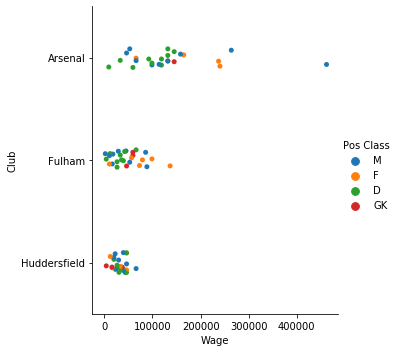


#### Quick Overview and Descriptive Statistics


```python
sns.countplot(x='Pos Class', data=df)
```


    <matplotlib.axes._subplots.AxesSubplot at 0x1a21573a20>


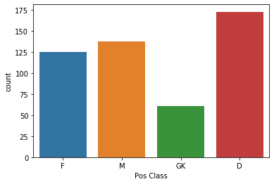


```python
sns.countplot(x='Pos.', data=df, order=['GK', 'CB', 'RB', 'LB', 'CM', 'DM', 'AM', 'RM', 'LM', 'CF', 'RW', 'LW', 'SS'])
```


    <matplotlib.axes._subplots.AxesSubplot at 0x1a21769240>


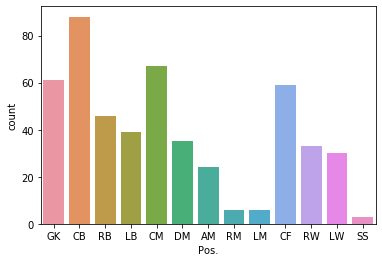


```python
sns.countplot(x='Age', data=df, color='red') #make nicer visually
```


    <matplotlib.axes._subplots.AxesSubplot at 0x11d24f240>


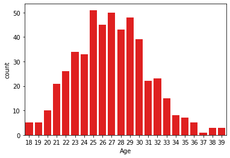


```python
df['Age'].describe()
```


    count    497.000000
    mean      26.983903
    std        3.991895
    min       18.000000
    25%       24.000000
    50%       27.000000
    75%       30.000000
    max       39.000000
    Name: Age, dtype: float64


Is there a relation between age and wage?


```python
sns.scatterplot(x='Age', y='Wage', data=df)
plt.axhline(df['Wage'].median(), 0,1, color='red')
plt.axhline(df['Wage'].quantile(0.75), 0,1, color='red')
plt.axhline(df['Wage'].quantile(0.90), 0,1, color='red')

```


    <matplotlib.lines.Line2D at 0x1a22c279e8>


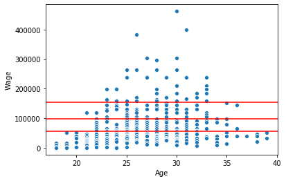


It seems like there is sometype of negative parabolic relation between age and wage

Lets look at how wage distribution by position type


```python
sns.catplot(x='Pos Class', y="Wage", data=df, kind='box', order=['F','M','D','GK']) #fix color
Fmed = df[df['Pos Class']=='F']['Wage'].median()
Mmed = df[df['Pos Class']=='M']['Wage'].median()
Dmed = df[df['Pos Class']=='D']['Wage'].median()
GKmed = df[df['Pos Class']=='GK']['Wage'].median()
print('Forwards median:', int(Fmed), 'Midfielders median:', int(Mmed), 'Defenders median:', int(Dmed), 'Keepers median:', int(GKmed))
```

    Forwards median: 65966 Midfielders median: 59370 Defenders median: 52773 Keepers median: 46177


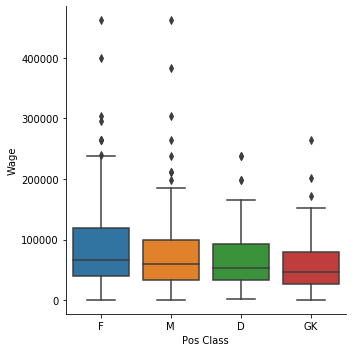


No love for Defenders and Keepers, but I guess thats why they say they pay Forwards the big bucks. Midfielders seem to have a similar distribution to forwards


```python

```


```python

```


```python

```


```python

```


```python

```


```python
plt.scatter(df['Age'], df['Wage'])
plt.axvline(df['Age'].median(), 0,1, color='red')
```


    <matplotlib.lines.Line2D at 0x1a20207160>


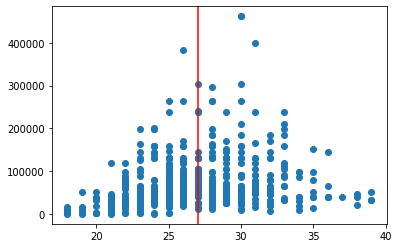


```python
sns.catplot(x='Age', y="Wage", data=df, kind='box')
```


    <seaborn.axisgrid.FacetGrid at 0x1a201bb860>


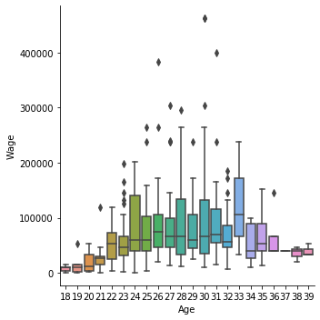


```python
sns.distplot(df['Age'], kde=False)
```

    /Users/simonbfisher/anaconda3/lib/python3.6/site-packages/scipy/stats/stats.py:1713: FutureWarning: Using a non-tuple sequence for multidimensional indexing is deprecated; use `arr[tuple(seq)]` instead of `arr[seq]`. In the future this will be interpreted as an array index, `arr[np.array(seq)]`, which will result either in an error or a different result.
      return np.add.reduce(sorted[indexer] * weights, axis=axis) / sumval


    <matplotlib.axes._subplots.AxesSubplot at 0x1a1d1b6be0>


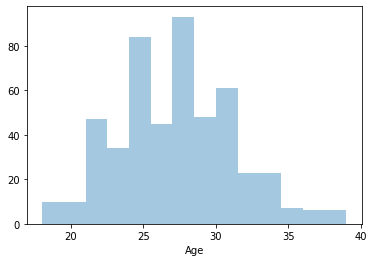


```python
sns.distplot(df['Weekly Salary'], kde=False)
```

    /Users/simonbfisher/anaconda3/lib/python3.6/site-packages/scipy/stats/stats.py:1713: FutureWarning: Using a non-tuple sequence for multidimensional indexing is deprecated; use `arr[tuple(seq)]` instead of `arr[seq]`. In the future this will be interpreted as an array index, `arr[np.array(seq)]`, which will result either in an error or a different result.
      return np.add.reduce(sorted[indexer] * weights, axis=axis) / sumval


    <matplotlib.axes._subplots.AxesSubplot at 0x1a1d49e208>


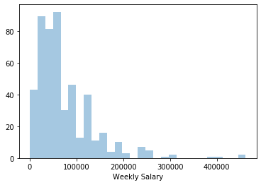


```python
q75 = float(df['Weekly Salary'].quantile([0.75]))
df75 = df[df['Weekly Salary']<q75]
```


```python
sns.distplot(df75['Weekly Salary'])
```

    /Users/simonbfisher/anaconda3/lib/python3.6/site-packages/scipy/stats/stats.py:1713: FutureWarning: Using a non-tuple sequence for multidimensional indexing is deprecated; use `arr[tuple(seq)]` instead of `arr[seq]`. In the future this will be interpreted as an array index, `arr[np.array(seq)]`, which will result either in an error or a different result.
      return np.add.reduce(sorted[indexer] * weights, axis=axis) / sumval


    <matplotlib.axes._subplots.AxesSubplot at 0x1a1d814d68>


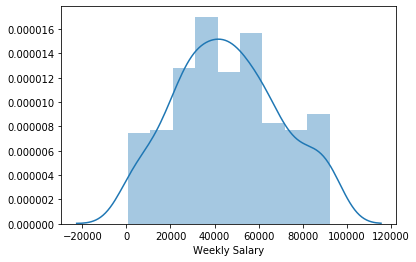


```python

```
